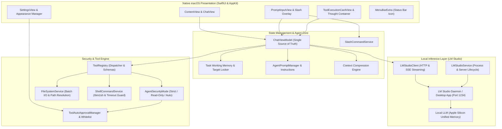
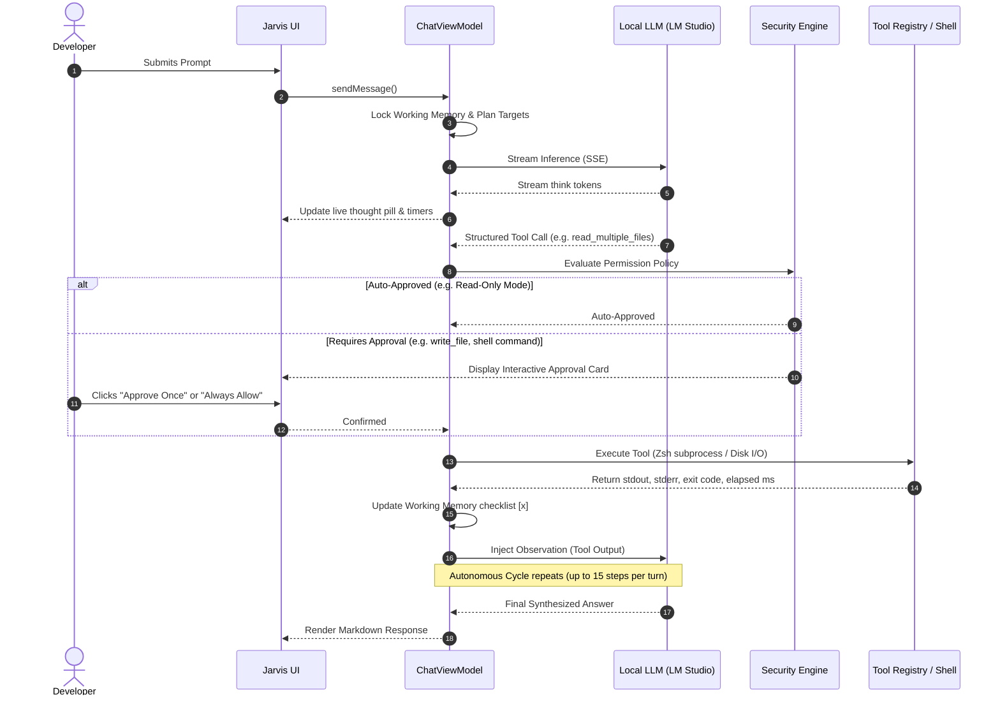
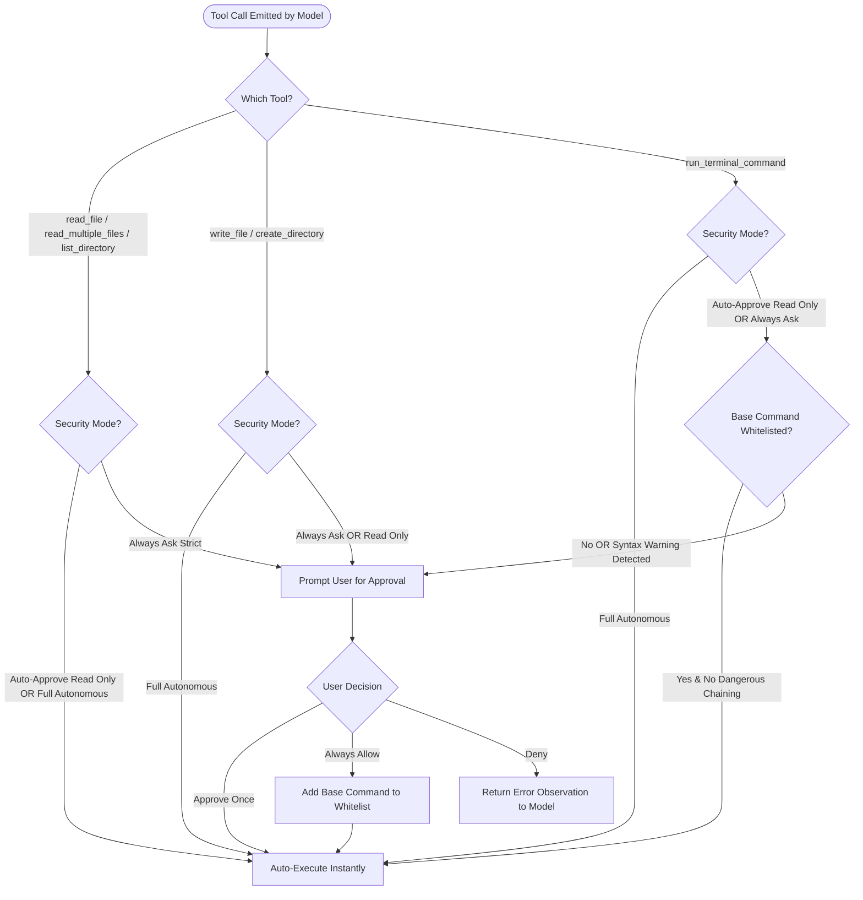

# Jarvis

<p align="center">
  <strong>Native, Privacy-First Autonomous AI Desktop Assistant for macOS</strong><br>
  Powered by Local LLMs via LM Studio • Built with 100% Native SwiftUI & AppKit • Zero External Dependencies
</p>

<p align="center">
  
  
  
  
  
  
</p>

---

## Table of Contents

1. [Introduction](#introduction)
2. [High-Level Architecture](#high-level-architecture)
3. [Autonomous Execution Loop](#autonomous-execution-loop)
4. [Security & Permission Gateway](#security--permission-gateway)
5. [Core Capabilities](#core-capabilities)
   - [Local & Private Inference Engine](#1-local--private-inference-engine)
   - [Autonomous Multi-Turn Agentic Workflows](#2-autonomous-multi-turn-agentic-workflows)
   - [Transparent Reasoning & Thought Tracing](#3-transparent-reasoning--thought-tracing)
   - [Persistent Working Memory & Anti-Hallucination](#4-persistent-working-memory--anti-hallucination)
   - [Granular 3-Tier Security Policy](#5-granular-3-tier-security-policy)
   - [Context Management & Automatic Compression](#6-context-management--automatic-compression)
   - [Slash Command Palette](#7-slash-command-palette)
   - [Active Workspace & Path Management](#8-active-workspace--path-management)
   - [Native macOS Integration & Theming](#9-native-macos-integration--theming)
6. [Tool Ecosystem Reference](#tool-ecosystem-reference)
7. [Slash Commands Reference](#slash-commands-reference)
8. [Codebase Architecture & File Tree](#codebase-architecture--file-tree)
9. [Getting Started & Installation](#getting-started--installation)
10. [Configuration & Settings](#configuration--settings)

---

## Introduction

**Jarvis** is an autonomous developer assistant running natively on macOS. Unlike cloud-based AI tools, Jarvis operates **100% locally** by interfacing directly with local Large Language Models (LLMs) hosted inside [LM Studio](https://lmstudio.ai/) (e.g. Gemma 4, Qwen 2.5, Llama 3, DeepSeek).

Jarvis is designed for software engineers, power users, and privacy-conscious developers who want an autonomous coding copilot capable of inspecting multi-file codebases, executing terminal workflows, running tests, creating project structures, and reasoning through complex programming tasks—**all without sending a single byte of telemetry or code to external servers**.

---

## High-Level Architecture

Jarvis uses a clean separation of concerns between native AppKit/SwiftUI presentation, local state orchestration, asynchronous HTTP/SSE streaming, and a sandboxed tool execution engine.



---

## Autonomous Execution Loop

When presented with a high-level user objective (e.g., *"Inspect the auth middleware, find why JWT tokens expire early, fix the token generator, and run the test suite"*), Jarvis initiates an autonomous, multi-turn plan-and-solve execution cycle.



---

## Security & Permission Gateway

Jarvis treats system access with utmost diligence. All actions are routed through a 3-tier security gateway before reaching the OS kernel:



---

## Core Capabilities

### 1. Local & Private Inference Engine
- **100% Air-Gapped Operation**: Connects to `http://127.0.0.1:1234` powered by LM Studio. No API keys, no external subscriptions, and zero data leakage.
- **Apple Silicon Unified Memory Optimization**: Takes full advantage of M-series chips (M1/M2/M3/M4 Max/Pro/Ultra) for high-speed local token throughput.
- **Zero-CLI Fast Startup (< 1ms)**: Inspects `~/.lmstudio/models` and cached model identifiers directly via pure Swift `FileManager` without executing shell processes or waking up background services on launch.
- **Dynamic Model Switcher & Progress HUD**:
  - One-click **"Start Server & Load"** directly from the header toolbar.
  - Real-time animated progress bar with live percentage extraction while models are loaded into unified memory.
  - Automatically unloads idle background models to prevent RAM exhaustion and guardrail aborts.
- **Smart Ownership Lifecycle**:
  - Remembers whether Jarvis launched LM Studio or if the user launched it independently (`didJarvisLaunchServer`).
  - When closing Jarvis, LM Studio is cleanly terminated **only** if Jarvis was the one that launched it.
- **Instant Termination (< 0.05s)**:
  - Custom SIGKILL cleanup halts all LM Studio helper processes and crashpad daemons immediately without triggering macOS's 20-second watchdog hang or leaving Jarvis as a lingering "background app".

### 2. Autonomous Multi-Turn Agentic Workflows
- **Autonomous Feedback Loop**: Jarvis plans, calls tools, evaluates stderr/stdout observations, adjusts its approach if commands fail, and loops autonomously until the task is complete.
- **Step Safeguard**: Built-in 15-step execution cap per user prompt protects against runaway loops while giving the model ample headroom for large refactors.
- **Instant Stop Generation**: Users can click "Stop" at any millisecond during reasoning, tool execution, or output streaming to safely halt background subprocesses and retain all work produced up to that moment.

### 3. Transparent Reasoning & Thought Tracing
- **Separated Thinking Stream**: Intercepts reasoning tokens and formats them into sleek, collapsible thought pills.
- **Reasoning Telemetry**: Displays token counts and elapsed seconds for reasoning phases.
- **Copy Thoughts**: A dedicated one-click clipboard action copies the entire deliberation chain, active checklists, and intermediate tool call summaries as clean Markdown.
- **Interactive Tool Execution Cards**:
  - Real-time status badges (`pending_approval`, `running`, `completed`, `failed`, `rejected`).
  - Collapsible argument inspection and syntax-highlighted stdout/stderr terminal viewer.
  - One-click approval options: **Approve Once**, **Always Allow**, or **Deny**.

### 4. Persistent Working Memory & Anti-Hallucination
- **Plan Lock-In Protocol**: When Jarvis plans a multi-file task, it locks its target file list inside an explicit `<working_memory>` anchor.
- **No Target Churning**: Jarvis preserves this locked list across subsequent turns, preventing the model from forgetting earlier steps or inventing nonexistent files.
- **Enforced Reading**: The agent instructions strictly forbid summarizing files that have not been read through tool calls.

### 5. Granular 3-Tier Security Policy
- **Always Ask (Strict)**: Jarvis asks for permission before reading any file, listing directories, or running terminal commands.
- **Auto-Approve Read Only (Default & Recommended)**: Safe read operations (`read_file`, `read_multiple_files`, `list_directory`) run instantly without prompting, while file modifications and shell commands require explicit approval.
- **Full Autonomous**: All tool calls execute without prompts for hands-free, autonomous pipelines.
- **Heuristic Shell Safety Guard**: Parses terminal commands to flag dangerous patterns (e.g. destructive redirects `> /dev/`, `rm -rf`, recursive deletions, or chained subshell escapes).

### 6. Context Management & Automatic Compression
- **Live Token Gauge**: Header and sidebar meters track active context tokens against the model's physical window (e.g. 131,072 tokens for Gemma 4).
- **Compression Boundaries**: When conversations grow large, Jarvis establishes non-destructive compression boundaries. Earlier turns are compressed into a compact memory snapshot anchor while preserving the full visual history in the UI.

### 7. Slash Command Palette
- Type `/` in the prompt input to summon an interactive command palette with category chips, fuzzy filtering, keyboard arrow navigation, and `Tab` auto-completion.

### 8. Active Workspace & Path Management
- **Interactive Directory Picker**: Set the active working directory via the header button or `/dir` command.
- **Relative Path Resolution**: All file tools and shell commands execute relative to the selected project folder.
- **Context Injection**: Jarvis's dynamic system prompt automatically injects the current working directory path so the model never has to guess where project files reside.

### 9. Native macOS Integration & Theming
- **Appearance Modes**: Built-in Dark, Light, and System themes that immediately synchronize with macOS system appearance.
- **Optional Menu Bar Extra**: Keep Jarvis tucked in the top-right macOS menu bar for rapid access or quick quitting.
- **100% Native**: Zero Electron, zero webviews, zero bloated runtimes. Built purely in Swift, SwiftUI, and AppKit for instant launch times and minimal battery consumption.

---

## Tool Ecosystem Reference

Jarvis equips local models with 6 native system tools formatted as standard OpenAI function-calling schemas:

| Tool Name | Parameters | Description | Default Permission |
| :--- | :--- | :--- | :--- |
| `read_multiple_files` | `paths`: array of strings<br>`max_bytes_per_file`: int (opt) | Reads multiple files concurrently in a single turn. **Preferred tool** for multi-file inspections. | Auto-Approved in Read-Only mode |
| `read_file` | `path`: string<br>`max_bytes`: int (opt) | Reads the text content of a single local file. Supports `~` expansion and relative paths. | Auto-Approved in Read-Only mode |
| `list_directory` | `path`: string | Lists directory contents with item names, types (file vs dir), and file sizes. | Auto-Approved in Read-Only mode |
| `write_file` | `path`: string<br>`content`: string<br>`overwrite`: bool (opt) | Creates or replaces a file with exact text content. Automatically creates parent directories. | Requires Approval |
| `create_directory` | `path`: string | Creates a folder and any necessary intermediate parent directories on disk. | Requires Approval |
| `run_terminal_command` | `command`: string<br>`working_directory`: string (opt) | Executes a shell command via `/bin/zsh`. Captures stdout, stderr, exit codes, and duration. | Requires Approval (or Whitelist) |

---

## Slash Commands Reference

Quickly trigger commands anywhere in the chat prompt using `/`:

| Command | Syntax | Category | Description |
| :--- | :--- | :--- | :--- |
| `/compress` | `/compress [low\|med\|high]` | `Context` | Condenses conversation history into a memory snapshot anchor (preserves UI messages). |
| `/compression`| `/compression [low\|med\|high]`| `Context` | Alias for `/compress`. |
| `/think` | `/think [low\|med\|high\|max\|off]` | `Model` | Sets the reasoning token budget (e.g. `/think low` = 1024, `/think max` = 16384, `/think 2048`). |
| `/model` | `/model [name]` | `Model` | Switches active model, boots LM Studio if offline, and loads weights into memory. |
| `/dir` | `/dir [path]` | `Tools` | Sets the active project working directory, or opens native macOS folder picker if no path given. |
| `/clear` | `/clear` | `Session` | Clears all messages in the current conversation. |
| `/new` | `/new` | `Session` | Opens a new blank chat session. |
| `/export` | `/export` | `Session` | Formats and copies the complete conversation history as clean Markdown to the clipboard. |
| `/instructions`| `/instructions` | `Tools` | Opens the local `~/.jarvis/instructions.md` configuration file in your default editor. |
| `/help` | `/help` | `Help` | Displays an interactive reference guide of all available commands and tool usage. |

---

## Codebase Architecture & File Tree

```
Jarvis/
├── JarvisApp.swift                        # App entry point, AppDelegate lifecycle, menu commands, instant termination
├── ContentView.swift                      # Primary UI scaffold: header toolbar, token gauge, message list, turn grouping
├── ChatViewModel.swift                    # Central observable state: autonomous loop, SSE handling, timer controls
├── LMStudioClient.swift                   # Async HTTP & SSE client for LM Studio /v1/chat/completions & /api/v0/models
├── LMStudioService.swift                  # CLI / daemon lifecycle, process discovery, unified memory offloading, SIGKILL
├── AgentPromptManager.swift               # Dynamic system prompt composer with tool schemas and working dir injection
├── AgentInstructions.md                   # Behavioral guidelines: plan lock-in, working memory format, anti-hallucination
├── ToolRegistry.swift                     # OpenAI tool definition schemas, execution dispatcher, argument parser
├── ToolExecutionCardView.swift            # Interactive approval card UI with stdout/stderr viewers and whitelist buttons
├── PreResponseExecutionContainerView.swift # Collapsible thought pills, reasoning timers, and "Copy Thoughts" exporter
├── PromptInputView.swift                  # Dynamic prompt text editor, slash command overlay palette, shortcut handler
├── SlashCommandService.swift              # Slash command registry, fuzzy search, categories, and parameter parser
├── SettingsView.swift                     # macOS Settings panel: themes, security modes, whitelists, launch configurations
├── AppSettings.swift                      # Persistent settings (UserDefaults), security rules, command safety heuristics
├── FileSystemService.swift                # Disk I/O, path sanitization, batch reading with concurrency limits
├── ShellCommandService.swift              # /bin/zsh process execution, 30s timeout safety guard, syntax analysis
├── ConversationStorageService.swift       # JSON conversation persistence in ~/Library/Application Support/Jarvis
└── SidebarView.swift                      # Collapsible conversation history drawer with search, rename, and deletion
```

---

## Getting Started & Installation

### Prerequisites
1. **macOS 14.0 (Sonoma)** or later running on **Apple Silicon** (M1/M2/M3/M4).
2. **Xcode 15.0+** (or Command Line Tools).
3. **[LM Studio](https://lmstudio.ai/)** (v0.3.0+ or v0.4.0+ recommended).
   - Ensure the LM Studio CLI tool `lms` is installed:
     ```bash
     lms bootstrap
     ```
   - Download your preferred local model (e.g. `google/gemma-4-e2b`, `google/gemma-4-12b`, or `Qwen2.5-14B`).

### Building from Source

1. **Clone the repository**:
   ```bash
   git clone https://github.com/maksimsterkis/Jarvis.git
   cd Jarvis
   ```

2. **Open in Xcode**:
   ```bash
   open Jarvis.xcodeproj
   ```

3. **Build & Run**:
   - Select the `Jarvis` scheme and target **My Mac (Mac Catalyst or Native macOS)**.
   - Press `Cmd + R` to build and launch.

4. **Command-Line Build**:
   ```bash
   xcodebuild -project Jarvis.xcodeproj -scheme Jarvis -configuration Release build
   ```

---

## Configuration & Settings

Access **Settings** via `Cmd + ,` or from the **Jarvis** menu:

- **Appearance**: Toggle between System, Light, and Dark modes.
- **Menu Bar**: Enable the status bar icon for quick background access.
- **Local Inference Engine**:
  - **Launch Mode**: Choose between **Headless (lms)** (fast daemon without windows) or **Desktop App** (full GUI).
  - **Auto-Start Server on Launch**: Automatically boots the server and loads your default model when Jarvis opens (disabled by default).
  - **Unload Models & Stop Server on Quit**: Automatically unloads model weights and stops the server when closing Jarvis (if Jarvis started it).
- **Security Policies**:
  - Toggle between **Strict**, **Auto-Approve Read Only**, and **Full Autonomous**.
  - Manage the **Command Whitelist** to review or remove pre-approved terminal binaries.
- **Reasoning Budget**:
  - Select your default thinking budget: **Low (1,024)**, **Medium (4,096)**, **High (8,192)**, or **Max (16,384)** tokens.

---

## License

Jarvis is open-source software licensed under the [MIT License](LICENSE).

