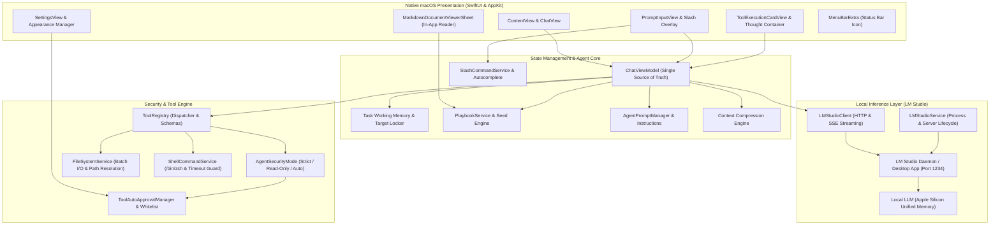
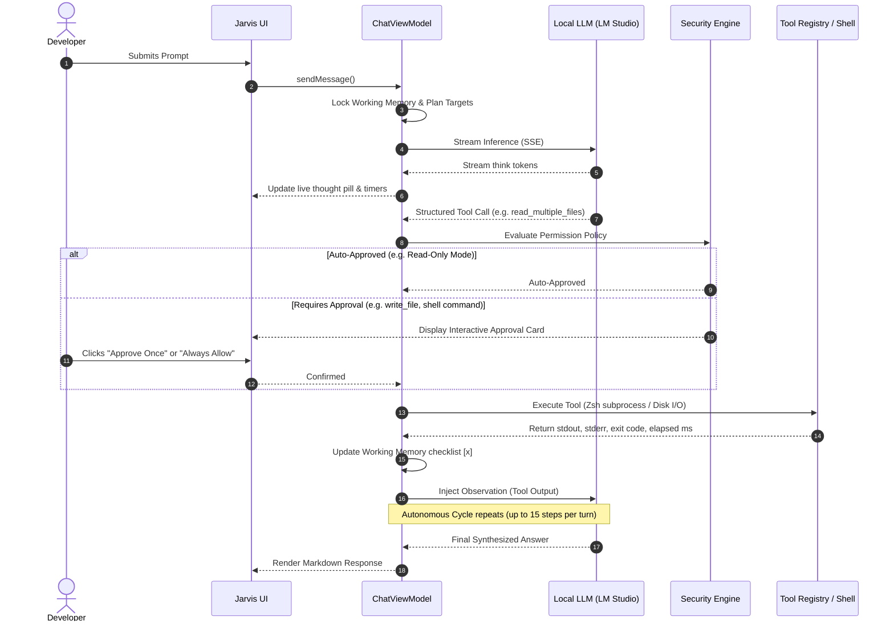

# Jarvis Architecture & Execution Engine

Jarvis is designed with a strict separation of concerns between native macOS presentation (AppKit & SwiftUI), local state orchestration, asynchronous HTTP/SSE streaming, and a sandboxed system tool execution engine.

---

## High-Level System Architecture



---

## Autonomous Execution Loop

When presented with a high-level user objective (e.g., *"Inspect the auth middleware, find why JWT tokens expire early, fix the token generator, and run the test suite"*), Jarvis initiates an autonomous, multi-turn plan-and-solve execution cycle.



### Execution Safeguards
- **15-Step Execution Cap**: Protects against runaway inference loops while providing sufficient headroom for multi-file refactors.
- **Immediate Subprocess Termination**: Clicking "Stop" halts running child processes (`/bin/zsh`) and terminates SSE streams immediately.
- **State Preservation**: Any partial output, completed tool calls, or generated files are cleanly retained upon user cancellation.

---

## Codebase Architecture & File Tree

```
Jarvis/
├── JarvisApp.swift                        # App entry point, AppDelegate lifecycle, menu commands, instant termination
├── ContentView.swift                      # Primary UI scaffold: header toolbar, token gauge, message list, anchored 120 FPS thinking overlay
├── ChatViewModel.swift                    # Central observable state: autonomous loop, SSE handling, timer controls, slash command execution
├── LMStudioClient.swift                   # Async HTTP & SSE client for LM Studio /v1/chat/completions & /api/v0/models
├── LMStudioService.swift                  # CLI / daemon lifecycle, process discovery, unified memory offloading, SIGKILL
├── AgentPromptManager.swift               # Dynamic system prompt composer with tool schemas and working dir injection
├── AgentInstructions.md                   # Behavioral guidelines: plan lock-in, working memory format, anti-hallucination
├── PlaybookService.swift                  # Playbooks discovery, automatic seeding into ~/.jarvis/playbooks/, validation, and loading
├── ToolRegistry.swift                     # OpenAI tool definition schemas, execution dispatcher, argument parser
├── ToolExecutionCardView.swift            # Interactive approval card UI with stdout/stderr viewers and whitelist buttons
├── PreResponseExecutionContainerView.swift # Collapsible thought pills, reasoning timers, and "Copy Thoughts" exporter
├── PromptInputView.swift                  # Dynamic prompt text editor, slash command overlay palette with argument autocomplete
├── SlashCommandService.swift              # Slash command registry, argument autocomplete engine (playbooks, levels, presets, models)
├── MarkdownDocumentViewerSheet.swift      # Native in-app rendered markdown viewer sheet for playbooks and instructions
├── MarkdownMessageView.swift              # Custom Swift markdown parser rendering H1–H6, syntax code blocks, and markdown tables
├── CompressionBoundaryView.swift          # Visual divider and collapsible memory snapshot card indicating context compaction
├── JarvisLogoView.swift                   # Native SwiftUI vector logo with animated pulsing glow and status indicator
├── SettingsView.swift                     # macOS Settings panel: themes, security modes, whitelists, launch configurations
├── AppSettings.swift                      # Persistent settings (UserDefaults), security rules, command safety heuristics
├── FileSystemService.swift                # Disk I/O, path sanitization, batch reading with concurrency limits
├── ShellCommandService.swift              # /bin/zsh process execution, 30s timeout safety guard, syntax analysis
├── ConversationStorageService.swift       # JSON conversation persistence in ~/Library/Application Support/Jarvis
├── SidebarView.swift                      # Collapsible conversation history drawer with search, rename, and deletion
└── Playbooks/                             # Bundled authoritative markdown playbooks (seeded to ~/.jarvis/playbooks/)
    ├── coding_and_testing.md              # Scaffolding, test writing, working directory rules, Errno 2 diagnostics
    ├── filesystem_and_paths.md            # macOS path resolution, tilde expansion, atomic file creation
    ├── terminal_execution.md              # Non-interactive shell commands, exit-code validation, directory switching
    └── codebase_auditing.md               # Multi-file batch inspection and architectural synthesis
```

---

## Related Documentation

- [Security & Permission Gateway](security.md)
- [Core Features & Capabilities](features.md)
- [Tool Ecosystem Reference](tools.md)
- [Slash Commands & Shortcuts](commands.md)
