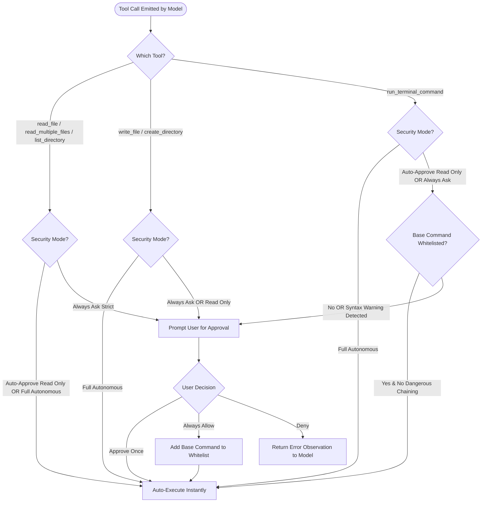

# Security & Permission Gateway

Jarvis operates with direct system access on macOS. To maintain absolute control over developer environments, all model actions pass through a 3-tier security gateway before reaching the OS kernel or filesystem.

---

## Permission Evaluation Flowchart

---

## 3-Tier Security Modes

Users can select the active security policy in **Settings** (`Cmd + ,`) under the **Security** tab:

| Mode | Read Operations (`read_file`, `list_directory`) | File Modifications (`write_file`, `create_directory`) | Shell Commands (`run_terminal_command`) | Best For |
| :--- | :--- | :--- | :--- | :--- |
| **Strict (Always Ask)** | Requires Approval | Requires Approval | Requires Approval | Maximum paranoia, new environments, auditing untrusted prompts. |
| **Auto-Approve Read Only** *(Default & Recommended)* | **Auto-Approved** | Requires Approval | Requires Approval (unless whitelisted) | Ideal balance: instant code browsing and inspection with protected write/execute permissions. |
| **Full Autonomous** | **Auto-Approved** | **Auto-Approved** | **Auto-Approved** | Automated batch pipelines, trusted isolated environments, and hands-free prototyping. |

---

## Interactive Approval Cards

When a tool call requires user confirmation, Jarvis pauses execution and presents an interactive `ToolExecutionCardView`:

- **Full Parameter Inspection**: View exact file paths, written content, shell commands, and working directory.
- **Approval Actions**:
  - **Approve Once**: Runs this specific invocation without modifying global permissions.
  - **Always Allow**: Auto-approves this invocation and appends the base command (e.g. `swift`, `python3`, `git`) to your persistent whitelist.
  - **Deny**: Cancels the call immediately and sends a feedback error back to the model so it can pivot to an alternative strategy.

---

## Shell Command Safety Heuristics

Before any shell command is evaluated against the whitelist or auto-approved, `AppSettings.swift` and `ShellCommandService.swift` analyze the command syntax for destructive patterns:

1. **Destructive Deletion**: Commands containing `rm -rf /`, `rm -rf ~`, or unquoted wildcard deletions trigger an immediate warning prompt regardless of whitelist status.
2. **Device Redirections**: Redirections targeting system character devices (e.g. `> /dev/sda`, `> /dev/disk`) are flagged.
3. **Chained Subshell Escapes**: Chained operations using `;`, `&&`, or `||` that introduce non-whitelisted binaries bypass auto-approval and require explicit confirmation.
4. **Subprocess Timeout Guard**: All terminal processes are monitored by a strict 30-second watchdog timer to eliminate hangs on interactive prompts or infinite loops.

---

## Managing the Whitelist

- Open **Settings (`Cmd + ,`)** > **Security**.
- View all pre-approved binaries (e.g. `git`, `swift`, `cargo`, `npm`, `pytest`).
- Remove any command from the whitelist at any time with a single click.

---

## Related Documentation

- [Architecture & Execution Engine](architecture.md)
- [Tool Ecosystem Reference](tools.md)
- [Core Features & Capabilities](features.md)
