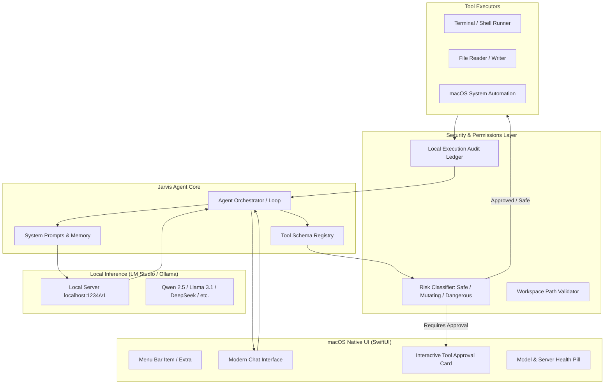

# Implementation Plan: Jarvis — Local-First Secure Autonomous Agent for macOS

Jarvis is a native macOS application designed as a secure, private, and local-first autonomous agent (inspired by tools like OpenClaw / Open Interpreter), powered entirely by local models (e.g., LM Studio or Ollama). Unlike terminal-bound tools, Jarvis provides a modern macOS interface with interactive tool approval, real-time command diffs, and sandboxed execution.

---

## User Review Required

> [!IMPORTANT]
> **Primary Starting Point**: We will begin with **Phase 1: Sleek Native UI Foundation**, building a polished, interactive chat & activity interface before wiring up the local LLM backend.

> [!CAUTION]
> **Security Baseline**: Because autonomous agents can execute shell commands and modify local files, Jarvis will enforce a **"Human-in-the-Loop" Security Architecture**:
> - **Safe / Read-Only Tier**: Allowed automatically (e.g., reading files in workspace, checking directory contents, pinging endpoints).
> - **Action / Mutation Tier**: Explicit inline approval required (e.g., writing files, running mutating shell commands).
> - **Blocked / Critical Tier**: Commands like `sudo`, raw disk formatting, or deleting outside a permitted workspace will be blocked by default unless explicitly whitelisted.

---

## Open Questions

1. **Window Presentation Style**:
   - Would you prefer Jarvis as a **floating HUD / Spotlight-style overlay** (toggled via hotkey/menu bar), a **standard macOS document/chat window**, or a **hybrid** (floating overlay with an option to detach/expand into a full window)?
2. **Local Inference Server**:
   - Is **LM Studio** (`http://localhost:1234/v1`) your preferred default server, or should we also provide built-in presets for **Ollama** (`http://localhost:11434/v1`)?
3. **Voice / Audio**:
   - In later phases, would you like local speech-to-text (e.g. Whisper) and TTS for a true "Iron Man Jarvis" conversational experience, or text-first?

---

## System Architecture



---

## Phased Implementation Plan

### Phase 1: Sleek Native UI Foundation (Starting Point)
- **Goal**: Create a native macOS interface with dark mode, glowing accents, streaming chat bubbles, activity timeline, and model status indicators.
- **Components**:
  - `MainWindow`: Split view with a conversational thread on the left and an "Activity / Tool Inspector" panel on the right (showing running commands, live terminal logs, file diffs).
  - `ChatBubble`: Rich markdown support, syntax-highlighted code blocks, tool-invocation preview blocks.
  - `StatusBarIndicator`: Pill showing connection state (`LM Studio: Connected (qwen2.5-coder-7b)` or `Disconnected`), token streaming velocity, and memory.
  - `ToolApprovalCard`: A dedicated card inside chat allowing the user to inspect the exact command or file patch and click **"Approve"**, **"Edit"**, or **"Deny"**.

### Phase 2: Local Model Connector (LM Studio Engine)
- **Goal**: Wire up local LLM streaming using the OpenAI-compatible REST API (`/v1/chat/completions` and `/v1/models`).
- **Components**:
  - `LMStudioClient`: Native Swift `URLSession` actor supporting Server-Sent Events (SSE) streaming tokens.
  - `ModelSelector`: Settings sheet to pick active model from LM Studio, configure temperature, context window, and endpoint URL.
  - `HealthMonitor`: Background timer that polls server readiness and displays status.

### Phase 3: Security & Sandboxing Framework
- **Goal**: Implement the security layer that makes Jarvis significantly safer than raw terminal agents.
- **Components**:
  - `SecurityPolicy`: Classification of commands into Green (read-only), Yellow (mutating, needs approval), and Red (forbidden).
  - `WorkspaceManager`: User-designated root directories (e.g. `~/Projects/MyApp`). Disallows arbitrary disk access outside workspace without explicit consent.
  - `AuditLedger`: JSON-based audit log recording every tool invocation, arguments, exit code, and timestamps.

### Phase 4: Autonomous Agent Loop & Tool Registry
- **Goal**: Enable multi-step reasoning where Jarvis can invoke tools, observe results, and iterate until the task is complete.
- **Components**:
  - `ToolRegistry`: Standard tool definitions formatted as OpenAI tool schemas (Shell command, File read/write, File tree/search).
  - `AgentLoop`: ReAct / Tool-calling engine that parses model tool calls, pauses for user approval when required, executes tools, and sends tool results back into the conversation context.
  - `CancelController`: Instant cancellation button (`Esc` or Stop button) to cleanly kill any running subprocess.

### Phase 5: macOS Automation Superpowers
- **Goal**: Give Jarvis macOS capabilities.
- **Components**:
  - AppleScript & JXA execution for controlling macOS apps (Calendar, Reminders, Finder, Notes, Music).
  - Shortcuts integration via `shortcuts run`.
  - Notification dispatcher for background task completions.

---

## Proposed Project File Structure

```
Jarvis/
├── JarvisApp.swift                   // App Entrypoint & MenuBarExtra
├── Core/
│   ├── Agent/
│   │   ├── AgentEngine.swift        // Agent loop & message orchestration
│   │   └── AgentState.swift         // Observable state for UI
│   ├── LLM/
│   │   ├── LMStudioClient.swift     // SSE Streaming HTTP client
│   │   └── LLMConfiguration.swift   // Server URL, model ID, params
│   ├── Security/
│   │   ├── SecurityPolicy.swift     // Safety classification & risk tiers
│   │   └── WorkspaceGuard.swift     // Path confinement & boundary checks
│   └── Tools/
│       ├── ToolProtocol.swift       // Common interface for agent tools
│       ├── ShellTool.swift          // Async Process runner with output capture
│       └── FileTool.swift           // Safe read/write/diff handler
└── UI/
    ├── Theme/
    │   └── JarvisTheme.swift        // Colors, typography, glassmorphism styles
    ├── Main/
    │   ├── JarvisMainView.swift     // Split-pane primary interface
    │   └── ActivitySidebar.swift    // Live tool execution & log drawer
    ├── Chat/
    │   ├── ChatView.swift           // Message list & prompt input
    │   ├── MessageBubbleView.swift  // User, assistant, and tool bubbles
    │   └── ToolApprovalCardView.swift // Human-in-the-loop interactive card
    └── Settings/
        └── SettingsView.swift       // LM Studio connection settings & model list
```

---

## Verification Plan

### Manual & Interactive Verification:
1. **UI Verification**:
   - Launch app via `xcodebuild` and verify the split chat view, status pill, and responsive layout.
   - Verify tool approval cards render with clean diffs and clickable Approve / Deny actions.
2. **Local Model Connectivity**:
   - Start LM Studio local server (`lms server start` or via LM Studio UI).
   - Test streaming text response in the Jarvis UI.
3. **Security Test**:
   - Attempt running a safe command (`ls`) -> verify execution with or without confirmation based on policy.
   - Attempt running a mutating command (`mkdir test_folder`) -> verify approval prompt blocks execution until clicked.
   - Attempt running a dangerous command outside workspace -> verify rejection by security policy.
